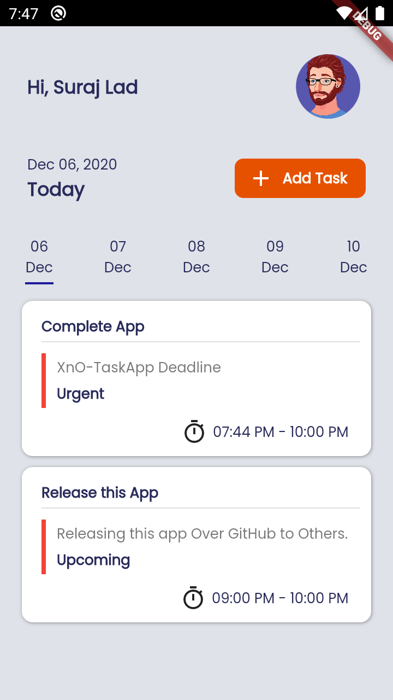
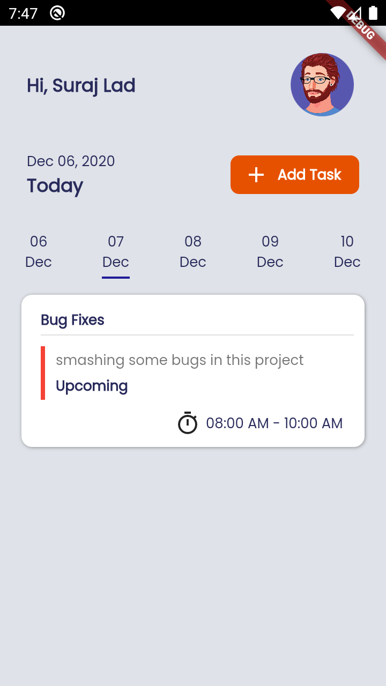
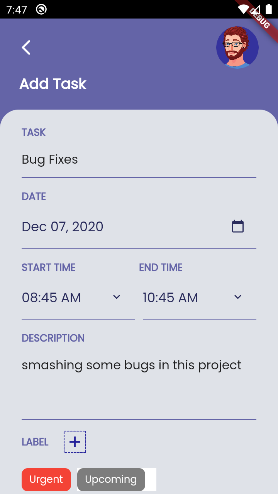
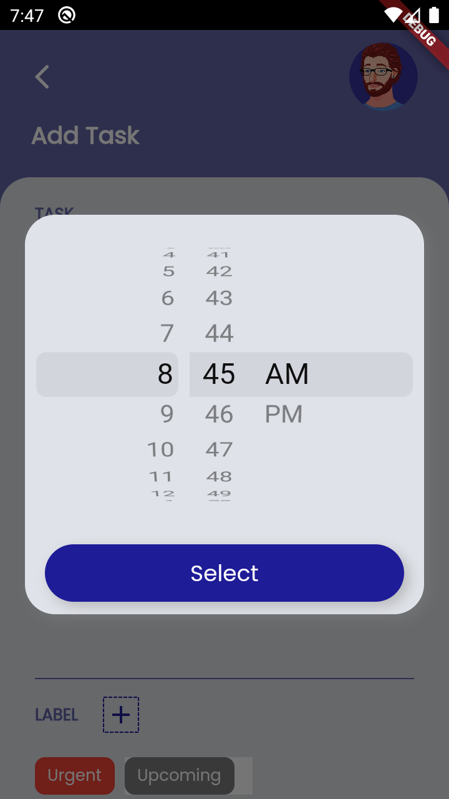

# Task Manager-App-Flutter

Task Manager App Made in Flutter.
 
#### Supported features:
- Create task 
- Dashboard
- Custom Task Label 
- Offline Storage in Hive DB

Test App by Downloading Apk From Screenshot/app.apk

#### Getting Started:

1. Clone/Download The Repo 
4. run ```flutter run ```

#### Screenshots:

 
 

#### Graphics Credits:

- [Mahmudul Hasan Manik for Devignedge](https://dribbble.com/shots/14156535-Taskito-Task-Management-App) - UI Inspired from here.
- FlatIcons
- FreePik
